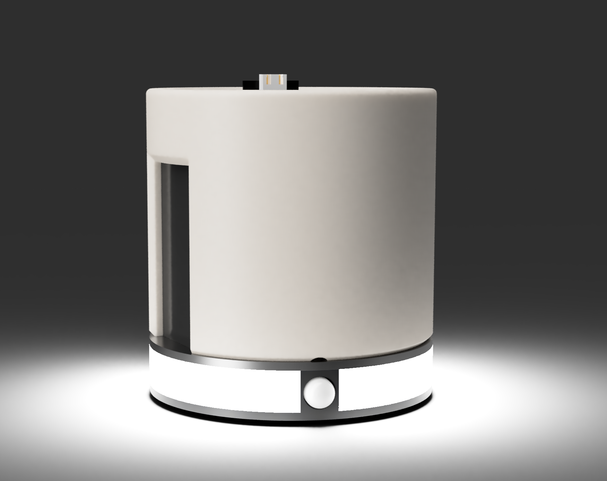
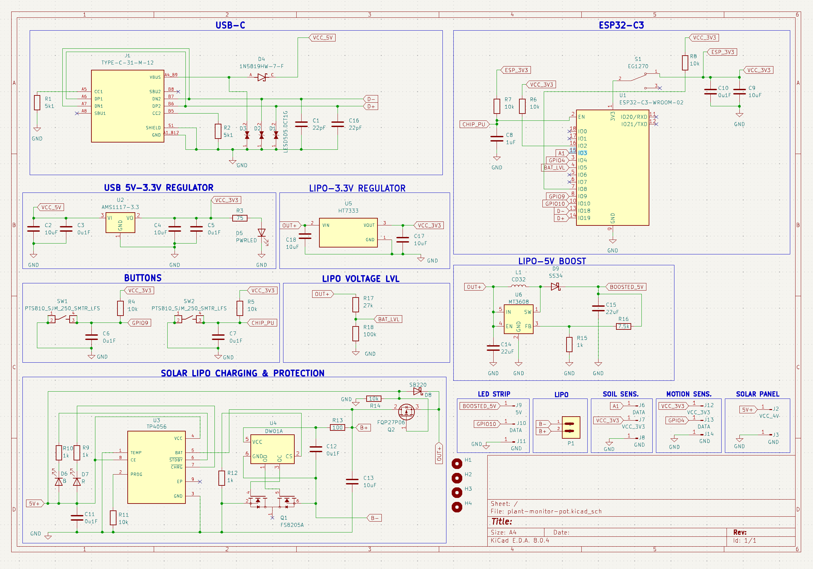
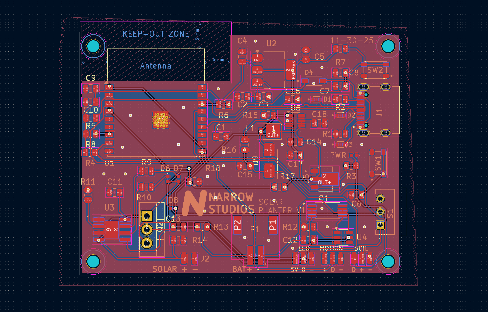

# SolarPlanter

A solar powered smart planter with built in soil moisture level monitoring.

## Key Features
- **ESP32-C3** microcontroller with WiFi + BLE Support
- **650 MAH** LiPo for backup power
- Built in **RGB LEDS** for notifications
- **Online logging** and monitoring via ESPHome
- **Motion sensor** to provide relevant notifications
- **ADC** to monitor battery voltage levels

## Why?
Keeping track of your plant's mositure, knowing when to water it, and also remembering to water it can be a challenging task, especially if you have more than one plant. Wanting a solution that was discrete and did not need me to ever charge the battery led me to make SolarPlanter.

